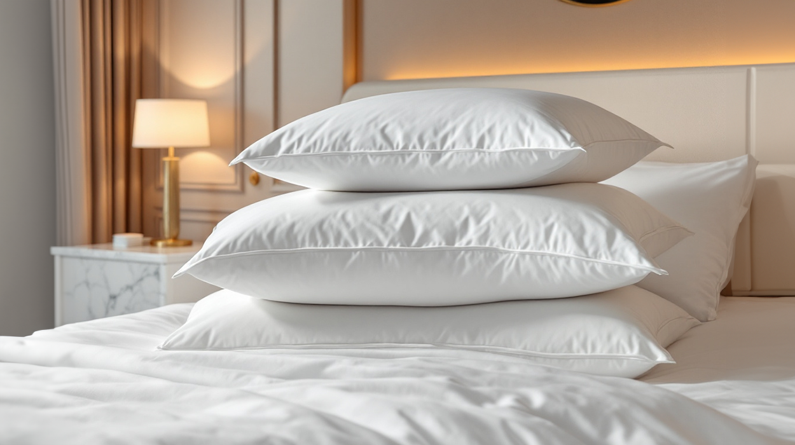

# Top 4 Most Common Reasons Why Your Pillow Always Goes Flat

There’s nothing worse than laying your head down at night only to find your once-fluffy pillow has turned into a pancake. A flat pillow doesn’t just ruin your comfort — it can also impact your sleep quality, posture, and even cause neck and back pain. But [why do pillows](https://dzeeusa.com/hotel-pillows.html) lose their shape so quickly?

Here are the top 4 most common reasons your pillow keeps going flat and what you can do about it.

---

## 1. Low-Quality Filling Materials

The number one reason pillows go flat is due to cheap or low-quality filling materials. Many budget pillows are stuffed with synthetic fibers that compress easily under weight and lose their bounce-back ability over time.

**Why it happens:**

- Poor-grade polyester or foam doesn't retain its structure.  
- The material can't withstand nightly pressure from your head and neck.  
- It breaks down faster, causing the pillow to collapse.

**What to do:**

- Invest in high-quality materials like memory foam, latex, feather, or down alternative fillings.  
- These offer better resilience, retain shape longer, and provide more consistent support.

---

## 2. Lack of Fluffing and Maintenance

Even high-quality pillows need a little TLC. If you never fluff or rotate your pillow, the fill will compress unevenly and settle, making the pillow flat and uncomfortable.

**Why it happens:**

- Regular pressure causes the filling to clump or settle.  
- No redistribution of the material leads to permanent dents or thin spots.

**What to do:**

- Make a habit of fluffing your pillow daily, shaking and kneading it to restore volume.  
- Rotate and flip your pillow weekly to avoid wear in the same spot.

.jpg)
---

## 3. Moisture and Sweat Build-Up

[Hotel pillows](https://dzeeusa.com/hotel-pillows.html) absorb sweat, drool, and humidity over time, especially if you're not using a proper pillow protector. This moisture breaks down the filling material and causes it to clump or become heavy and matted.

**Why it happens:**

- Body heat and sweat cause the interior fill to degrade.  
- Moisture makes fibers stick together, losing loft and support.

**What to do:**

- Use breathable pillow protectors and wash them regularly.  
- Allow your pillow to air out occasionally.  
- Ensure your bedroom is well-ventilated to reduce humidity buildup.

---

## 4. Natural Wear and Tear Over Time

Even the best pillows have a lifespan. Daily use causes wear and tear that eventually flattens even the most durable pillows.

**Why it happens:**

- Constant pressure breaks down internal structure.  
- Time and usage naturally reduce fluffiness and support.

**What to do:**

- Follow the general guideline of replacing your pillow every 1–2 years, depending on the type.  
- Memory foam pillows may last a bit longer, while polyester-filled ones often need replacing sooner.

---

## Final Thoughts

If your pillow keeps going flat, it’s probably not your imagination—it’s a common issue caused by poor materials, lack of care, moisture, or simple aging. Fortunately, with the right pillow and proper maintenance, you can extend its life and keep your nights restful.

A supportive, fluffy pillow isn’t just a luxury—it’s a sleep essential. Don’t settle for flat. Choose quality, care for it well, and enjoy the comfort your sleep deserves.
